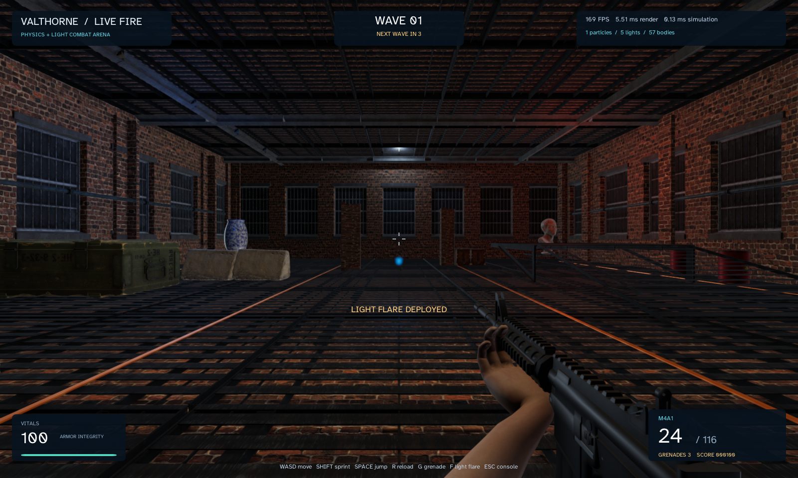

# Playable FPS arena

The arena combines gameplay and presentation: player movement, a rifle with reloads, grenades, drone waves, destructible props, transient particle lights and a pause/settings console. It uses reusable, textured CC0 assets rather than runtime downloads.

**Requires:** Windows x64, OpenGL 4.3, Filament and Jolt. See [platform support](platforms.md).

## Run without Gradle

Extract the [Windows desktop download](https://github.com/tehnewb/Valthorne-examples/releases/latest)
and double-click `fps.bat`. Java and dependencies are included. To run its smoke
check, open PowerShell in the extracted folder and use `.\fps.bat --smoke`.
See [runtime instructions](../README-RUNTIME.md) for other platforms and launch options.

## Build and run from source

```sh
./gradlew runFpsArena
./gradlew runFpsArena --args="--help"
./gradlew runFpsArena --args="--smoke"
```

Windows PowerShell uses `./gradlew.bat`. Use the repository root as the working
directory. The common launcher supplies a consistent entry point; Gradle supplies
native access and macOS first-thread flags where applicable.

## Controls

- Click **Enter arena** to capture the mouse; Escape pauses/releases it. Losing focus also pauses.
- **WASD** move, mouse looks, **Shift** sprints and **Space** jumps when grounded.
- **Left mouse** fires; **right mouse** aims. **R** reloads.
- **G** throws a grenade; **F** launches a luminous flare. Use the console to restart or edit effects/lighting.

## Read the implementation

Start at [FpsArena.java](../src/main/java/valthorne/examples/fps/FpsArena.java).
Its Javadoc describes the lifecycle and helper contracts. Generate the full reference
with `./gradlew javadoc`.

1. `FpsArena` owns rendering, first-person weapon presentation, menus and input ownership.
2. `FpsArenaWorld` owns fixed-step gameplay, bodies, combat queries, timers, waves and score. Hit events copy query vectors.
3. `FpsArenaEffects` owns bounded particles and their light/body attachments, borrowing the world.
4. Combat, environment and gallery libraries own shared assets across restarts.
5. Restart closes effects before replacing the world; disposal closes asset libraries only after their users stop.

## Modes and outputs

`--smoke` exercises native movement, aim/fire, reload, grenades, flares, pause and restart with captures. `--benchmark` uses 90 warm-up and 360 measured frames. Compare `--visual-particles`, `--no-particle-lights`, `--no-particle-shadows` or `--four-particle-shadows` deliberately; the last two are mutually exclusive.

Captures are written under `build/fps-arena/`. Collision uses simple proxies for structural modules and a smooth stair ramp. Arms are posed meshes; this is not a skeletal-animation tutorial.



## Extend it

Add a pickup or weapon by changing gameplay state in the world and observing it from the HUD. Preserve body filtering so shots do not hit the player’s own capsule. When adding an effect, cap its population and prove that restart removes its particles, bodies and lights. The executable gameplay validator is a useful example of isolated simulation checks.

Use [architecture and ownership](architecture.md) when extracting code into your
game. Run the affected smoke/validation checks after edits; [verification](verification.md)
explains which checks need a display and which are safe on a headless host.
