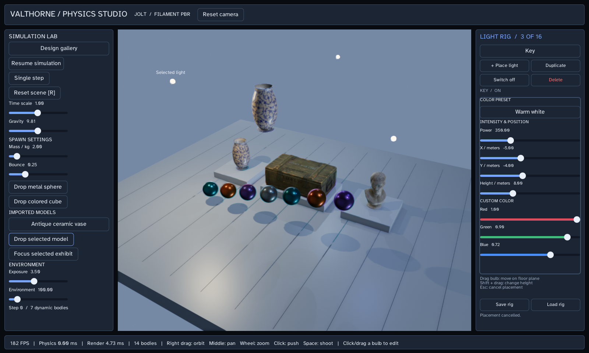

# Physics and lighting studio

A simulation workbench with a textured design gallery, pyramid/kinematic platform, dominoes/ramp, stress scene and particle fountain. Shared gallery assets and the editable light rig are separate components so scenario resets preserve reusable content.

**Requires:** Windows x64, OpenGL 4.3, Filament and Jolt. See [platform support](platforms.md).

## Run

```sh
./gradlew runPhysicsStudio
./gradlew runPhysicsStudio --args="--help"
./gradlew runPhysicsStudio --args="--smoke"
```

Windows PowerShell uses `./gradlew.bat`. Use the repository root as the working
directory. The common launcher supplies a consistent entry point; Gradle supplies
native access and macOS first-thread flags where applicable.

## Controls

- **Right drag / middle drag / wheel**: orbit, pan and zoom over the scene.
- **Click** a dynamic body to push it; **Space** launches a sphere; **R** resets.
- Select a bulb and drag horizontally, or **Shift+drag** for height. Escape cancels placement or exits.
- The panels provide pause, single-step, scenario selection, body settings, imported-model drops and light editing.

## Read the implementation

Start at [PhysicsStudio.java](../src/main/java/valthorne/examples/physicsstudio/PhysicsStudio.java).
Its Javadoc describes the lifecycle and helper contracts. Generate the full reference
with `./gradlew javadoc`.

1. `init` loads retained assets/rendering resources, attaches the shared rig and builds controls.
2. `reset` replaces the world and calls the selected scenario builder.
3. `body` binds visuals and collision; gallery exhibits use static mesh collision while dropped models use convex hulls.
4. `PhysicsStudioParticles` owns a bounded emitter and borrows the current world/scene.
5. Gesture helpers preserve UI ownership; disposal detaches listeners and closes emitters before the world.

## Modes and outputs

`--scenario=0..4`: pyramid/platform, dominoes/ramp, stress, gallery (default), particle fountain. `--lights=3..16` sets the initial rig size. `--visual-particles` disables particle-body collision; `--particle-rate=0..120` sets emissions per second. `--smoke` exercises scene/editor input. `--benchmark` warms up 60 frames and measures 240; `--smoke --scenario=4` specifically checks particle controls.

Saves: `build/physics-studio/rig.properties`. Captures: `build/physics-studio/scenario-N.png` and gallery inspection views.



## Extend it

Add a scenario as a distinct builder and preserve the existing reset/dispose boundaries. Use one borrowed mesh for many instances. Add a body property through the spawn settings rather than mutating a render transform independently of physics. Validate pause, single-step and reset with particles active.

Use [architecture and ownership](architecture.md) when extracting code into your
game. Run the affected smoke/validation checks after edits; [verification](verification.md)
explains which checks need a display and which are safe on a headless host.
