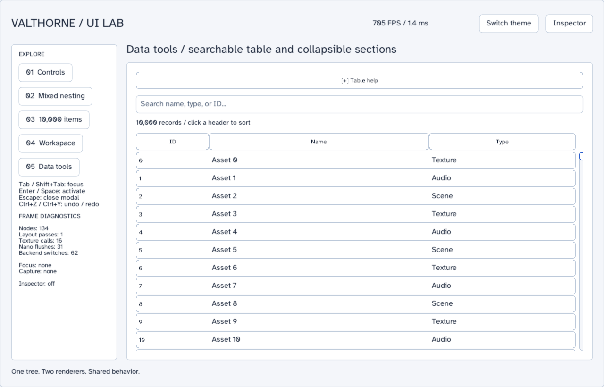

# UI component gallery

Explore five pages covering basic controls, mixed texture/NanoVG nesting, a 10,000-item virtual view, workspace tools, and a searchable/sortable table. Both rendering backends share layout, focus and pointer ownership.

**Requires:** OpenGL 3.3. See [platform support](platforms.md).

## Run

```sh
./gradlew runUIShowcase
./gradlew runUIShowcase --args="--help"
./gradlew runUIShowcase --args="--smoke"
```

Windows PowerShell uses `./gradlew.bat`. Use the repository root as the working
directory. The common launcher supplies a consistent entry point; Gradle supplies
native access and macOS first-thread flags where applicable.

## Controls

- Use the left navigation to select a page and the toolbar to switch theme or toggle inspection.
- **Tab / Shift+Tab**: move keyboard focus. **Enter / Space**: activate the focused control.
- **Escape**: dismiss a modal. Text editing uses the documented control shortcuts.
- Click table headers to sort and type in the search field to filter rows.

## Read the implementation

Start at [UIShowcase.java](../src/main/java/valthorne/examples/ui/UIShowcase.java).
Its Javadoc describes the lifecycle and helper contracts. Generate the full reference
with `./gradlew javadoc`.

1. `init` builds shared chrome, themes and the active page.
2. `reset` disposes replaced page content before a page builder adds its nodes.
3. `controls`, `mixed`, `largeList`, `advanced` and `dataTools` show separate, readable construction paths.
4. `AssetRow` supplies stable table data; virtualized controls reuse a bounded set of visible nodes.
5. The draw/update hooks use the shared UI hierarchy; inspection reads retained state instead of creating a second input system.

## Modes and outputs

`--smoke` visits every page, exercises representative interactions, captures the rendered states and exits. No benchmark flag is provided; the live diagnostics are observational frame metrics.

Smoke captures are written under `build/ui-showcase/`, including `controls.png`, `mixed.png`, `workspace.png` and `data-tools.png`. See the checked-in illustration below.



## Extend it

Add a page containing one texture-backed control nested inside a NanoVG container and one NanoVG control inside a texture-backed container. Verify keyboard focus, scrolling and modal capture. Add a table column without recreating all 10,000 row nodes.

Use [architecture and ownership](architecture.md) when extracting code into your
game. Run the affected smoke/validation checks after edits; [verification](verification.md)
explains which checks need a display and which are safe on a headless host.
